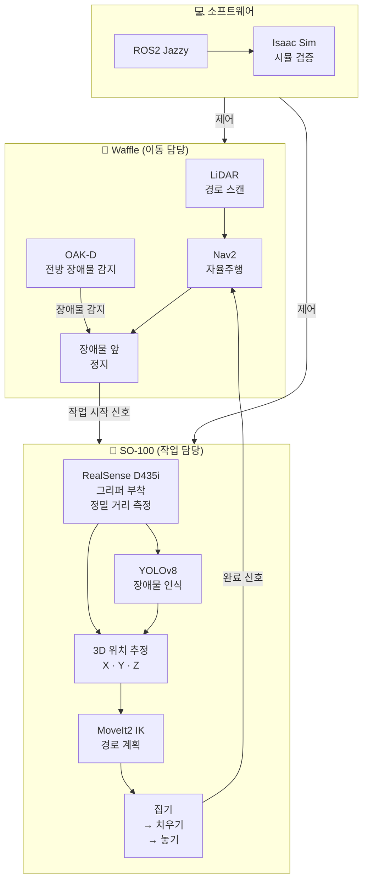

# 🤖 모바일 매니퓰레이터 — 장애물 감지 및 자율 제거 로봇

> TurtleBot3 Waffle + SO-100 로봇팔을 결합한 자율주행 기반 장애물 제거 시스템  
> 임베디드 소프트웨어 전공 졸업작품

---

## 📌 프로젝트 개요

본 프로젝트는 **자율주행 로봇(TurtleBot3 Waffle)** 위에 **6축 로봇팔(SO-100)** 을 탑재하여,
주행 중 전방에 나타난 장애물을 스스로 감지하고 제거하는 **모바일 매니퓰레이터** 시스템을 구현합니다.

### 핵심 아이디어 — 역할 분리

기존 로봇청소기 플랫폼(Waffle)에 로봇팔과 카메라를 함께 탑재하면 무게와 연산 부하가 커지는 문제가 있어요.
이를 해결하기 위해 **Waffle(이동)** 과 **SO-100(작업)** 의 역할을 명확히 분리했습니다.

```
Waffle  →  LiDAR + OAK-D로 장애물 감지 후 장애물 앞까지 이동 → 정지
SO-100  →  그리퍼에 부착된 RealSense로 정밀 위치 파악 후 집어서 치움
```

---

## 🎯 핵심 시나리오

```
① Waffle 자율주행 중
② OAK-D 카메라로 전방 장애물 감지
③ Waffle이 장애물 앞에서 자동 정지
④ SO-100 작업 시작 신호 수신
⑤ RealSense D435i (그리퍼 부착)로 장애물 3D 위치 정밀 파악
⑥ YOLOv8으로 집을 수 있는 물체인지 판별
⑦ MoveIt2 IK로 파지 경로 계획
⑧ SO-100이 장애물을 집어서 측면으로 치움
⑨ 완료 신호 → Waffle 주행 재개
```

---

## 🗂 시스템 아키텍처



---

## 🔧 하드웨어 구성

| 부품 | 역할 | 비고 |
|---|---|---|
| TurtleBot3 Waffle | 자율주행 모바일 베이스 | LiDAR 내장 |
| Raspberry Pi 5 / Orange Pi 5 | Waffle 온보드 컴퓨터 | 검토 중 |
| SO-100 로봇팔 (ROBOSEA) | 장애물 파지 및 제거 | Feetech STS3215 × 6축 |
| OAK-D 카메라 | Waffle 전방 장애물 감지 | RGB + Stereo Depth |
| Intel RealSense D435i | SO-100 그리퍼 부착 | 정밀 3D 위치 측정 |
| Desktop PC (RTX 3070) | 메인 연산 서버 | Ubuntu 22.04 (예정) |

### 카메라 역할 분리

| 카메라 | 부착 위치 | 역할 |
|---|---|---|
| OAK-D | Waffle 전방 | 장애물 존재 여부 감지 + 이동 경로 계산 |
| RealSense D435i | SO-100 그리퍼 | 장애물 정밀 거리 측정 + 집기 3D 좌표 계산 |

---

## 🛠 소프트웨어 스택

| 분류 | 기술 |
|---|---|
| 운영체제 | Ubuntu 24.04 (WSL2 개발) / Ubuntu 22.04 (Isaac Sim) |
| 미들웨어 | ROS2 Jazzy |
| 자율주행 | Nav2, SLAM (Cartographer), AMCL |
| 로봇팔 제어 | lerobot 0.5.1, Feetech SDK, MoveIt2 |
| 물체 인식 | YOLOv8 (커스텀 학습) |
| 시뮬레이션 | NVIDIA Isaac Sim |
| 시각화 | RViz2 |
| USB 연결 | usbipd-win (WSL2 ↔ SO-100) |

---

## 📁 디렉토리 구조

```
robot-arm/
├── README.md
├── blockdiagram.png                  # 시스템 아키텍처 블록도
├── src/
│   ├── object_detector_node.py       # YOLOv8 장애물 탐지
│   ├── pose_estimator_node.py        # RealSense → 3D 위치 추정
│   ├── grasp_planner_node.py         # MoveIt2 IK 파지 경로 계획
│   ├── arm_controller_node.py        # SO-100 관절 제어
│   ├── gripper_node.py               # 그리퍼 집기 · 놓기
│   ├── servo_bridge_node.py          # 관절각 → PWM · USB TTL
│   └── mode_manager_node.py          # Waffle ↔ SO-100 모드 전환
├── launch/
│   └── obstacle_removal.launch.py    # 전체 시스템 실행
├── config/
│   └── so100_params.yaml             # 서보 파라미터
└── models/
    └── best.pt                       # YOLOv8 학습 모델
```

---

## ⚙️ 개발 환경 세팅 현황

### 완료된 것

```
✅ WSL2 Ubuntu 24.04 설치
✅ ROS2 Jazzy 설치
✅ lerobot 0.5.1 설치
✅ usbipd-win으로 SO-100 USB 연결 (/dev/ttyACM0)
✅ VSCode WSL2 연결
✅ SO-100 서보 동작 확인
```

### 예정된 것

```
⬜ OAK-D 카메라 드라이버 설치
⬜ RealSense D435i 드라이버 설치
⬜ YOLOv8 장애물 커스텀 학습
⬜ MoveIt2 IK + grasp_planner 구현
⬜ 모드 매니저 자동 전환 구현
⬜ Ubuntu 22.04 듀얼부팅 + Isaac Sim 설치
⬜ 전체 통합 테스트
```

---

## 🚀 개발 진행 순서

```
1단계  SO-100 ROS2 서보 제어 노드 작성
        ↓
2단계  RealSense D435i + YOLOv8 물체 인식
        ↓
3단계  MoveIt2 IK + 집기 동작 구현
        ↓
4단계  Isaac Sim에서 시뮬 검증
        ↓
5단계  TurtleBot3 Waffle 연동
        ↓
6단계  OAK-D 장애물 감지 + 전체 통합
```

---

## 📖 참고 프로젝트

- [SO-ARM101 자율 쓰레기통 비우기 시스템](https://github.com/kcy0428/SO-ARM101)
  - lerobot + Feetech 서보 제어
  - YOLOv8 + RealSense D405 Eye-in-Hand
  - placo IK (역기구학)
  - Isaac Sim UDP 실시간 미러링

---

## 👤 개발자

- **park-taemin** — 임베디드 소프트웨어 전공
- GitHub: [https://github.com/park-taemin/capstone-design](https://github.com/park-taemin/capstone-design)
