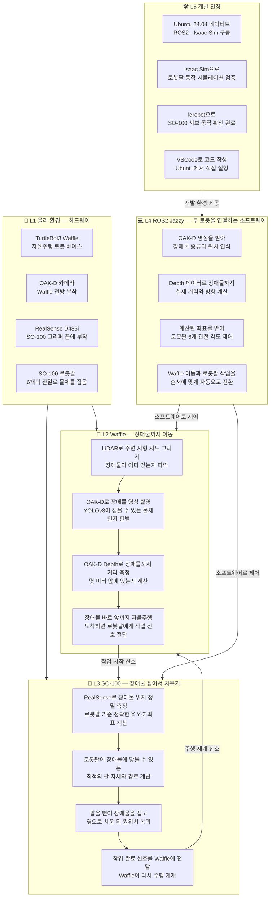

# 🤖 모바일 매니퓰레이터 — 장애물 감지 및 자율 제거 로봇

> TurtleBot3 Waffle + SO-100 로봇팔을 결합한 자율주행 기반 장애물 제거 시스템
> 임베디드 소프트웨어 전공 졸업작품

---

## 📌 프로젝트 개요

본 프로젝트는 **자율주행 로봇(TurtleBot3 Waffle)** 위에 **6축 로봇팔(SO-100)** 을 탑재하여,
주행 중 전방에 나타난 장애물을 스스로 감지하고 제거하는 **모바일 매니퓰레이터** 시스템을 구현합니다.

### 핵심 아이디어 — 역할 분리

카메라와 연산 부하를 줄이기 위해 **Waffle(이동)** 과 **SO-100(작업)** 의 역할을 명확히 분리했습니다.

| 역할 | 담당 장치 | 설명 |
|---|---|---|
| 이동 | TurtleBot3 Waffle | LiDAR + OAK-D로 장애물 감지 후 앞까지 이동 |
| 작업 | SO-100 로봇팔 | RealSense로 정밀 위치 파악 후 집어서 치움 |

---

## 🎯 핵심 시나리오

```
① Waffle이 LiDAR로 주변 지형을 스캔하며 자율주행
② OAK-D 카메라 + YOLOv8으로 전방 장애물 인식
③ OAK-D Depth로 장애물까지 거리 측정
④ Waffle이 장애물 바로 앞에 자동 정지
⑤ SO-100에 작업 시작 신호 전달
⑥ RealSense D435i(그리퍼 부착)로 장애물 정밀 3D 위치 계산
⑦ 로봇팔이 최적 자세로 장애물에 접근
⑧ 장애물을 집어서 측면으로 치운 뒤 원위치 복귀
⑨ 완료 신호 → Waffle 주행 재개
```

---

## 🗂 시스템 아키텍처



---

## 🔧 하드웨어 구성

| 부품 | 부착 위치 | 역할 |
|---|---|---|
| TurtleBot3 Waffle | 베이스 | 자율주행 · LiDAR 내장 |
| Raspberry Pi 5 | Waffle 탑재 | 온보드 컴퓨터 |
| OAK-D 카메라 | Waffle 전방 | 장애물 인식(YOLOv8) + Depth 거리 측정 |
| SO-100 로봇팔 (ROBOSEA) | Waffle 위 | 장애물 파지 및 제거 · Feetech STS3215 × 6축 |
| Intel RealSense D435i | SO-100 그리퍼 끝 | 정밀 3D 위치 측정 |
| Desktop PC (RTX 3070) | 개발용 PC | Ubuntu 24.04 · Isaac Sim · ROS2 |

### 카메라 역할 분리

| 카메라 | 부착 위치 | 역할 |
|---|---|---|
| OAK-D | Waffle 전방 | YOLOv8 장애물 인식 + Depth 거리 측정 동시 수행 |
| RealSense D435i | SO-100 그리퍼 끝 | 로봇팔 기준 장애물 정밀 3D 위치 계산 |

---

## 🛠 소프트웨어 스택

| 분류 | 기술 |
|---|---|
| 운영체제 | Ubuntu 24.04 (네이티브) |
| 미들웨어 | ROS2 Jazzy |
| 자율주행 | Nav2 · SLAM (Cartographer) · AMCL |
| 물체 인식 | YOLOv8 커스텀 학습 (OAK-D) |
| 로봇팔 제어 | lerobot 0.5.1 · Feetech SDK · MoveIt2 IK |
| 시뮬레이션 | NVIDIA Isaac Sim |
| 시각화 | RViz2 |

---

## 📁 디렉토리 구조

```
robot-arm/
├── README.md
├── src/
│   ├── obstacle_detector.py     # OAK-D + YOLOv8으로 장애물 찾기
│   ├── distance_estimator.py    # Depth → 장애물까지 3D 좌표 계산
│   ├── grasp_planner.py         # MoveIt2 IK로 최적 팔 자세 계산
│   ├── arm_controller.py        # SO-100 관절 각도 제어
│   ├── gripper_controller.py    # 집기 · 놓기 동작
│   └── mode_manager.py          # Waffle 이동 ↔ SO-100 작업 전환
├── launch/
│   └── obstacle_removal.launch.py
├── config/
│   └── so100_params.yaml
└── models/
    └── best.pt                  # YOLOv8 커스텀 학습 모델
```

---

## ⚙️ 개발 진행 현황

### ✅ 완료

- ROS2 Jazzy 설치 (WSL2 Ubuntu 24.04)
- lerobot 0.5.1 설치
- usbipd-win으로 SO-100 USB 연결 (`/dev/ttyACM0`)
- VSCode WSL2 연결
- SO-100 서보 동작 확인

### ⬜ 예정

- Ubuntu 24.04 네이티브 설치 (Windows 삭제)
- NVIDIA Isaac Sim 설치 및 SO-100 URDF 임포트
- OAK-D 드라이버 + YOLOv8 커스텀 학습
- RealSense D435i 드라이버 + 3D 위치 추정
- MoveIt2 IK + 집기 동작 구현
- TurtleBot3 Waffle 연동
- 전체 통합 테스트

---

## 🚀 개발 순서

```
1단계  Ubuntu 24.04 네이티브 설치 + Isaac Sim 세팅
        ↓
2단계  Isaac Sim에서 SO-100 URDF 임포트 + 시뮬 검증
        ↓
3단계  OAK-D + YOLOv8 장애물 커스텀 학습
        ↓
4단계  RealSense + MoveIt2 IK 집기 동작 구현
        ↓
5단계  TurtleBot3 Waffle + Nav2 자율주행 연동
        ↓
6단계  전체 통합 테스트 (이동 → 감지 → 집기 → 복귀)
```

---

## 📖 참고 프로젝트

- [SO-ARM101 자율 쓰레기통 비우기](https://github.com/kcy0428/SO-ARM101)
  - lerobot + Feetech 서보 제어
  - YOLOv8 + RealSense D405 Eye-in-Hand
  - placo IK (역기구학)
  - Isaac Sim UDP 실시간 미러링
  - Hand-Eye 캘리브레이션 (ChArUco 보드)

---

## 👤 개발자

- **park-taemin** — 임베디드 소프트웨어 전공
- GitHub: [https://github.com/park-taemin/capstone-design](https://github.com/park-taemin/capstone-design)
