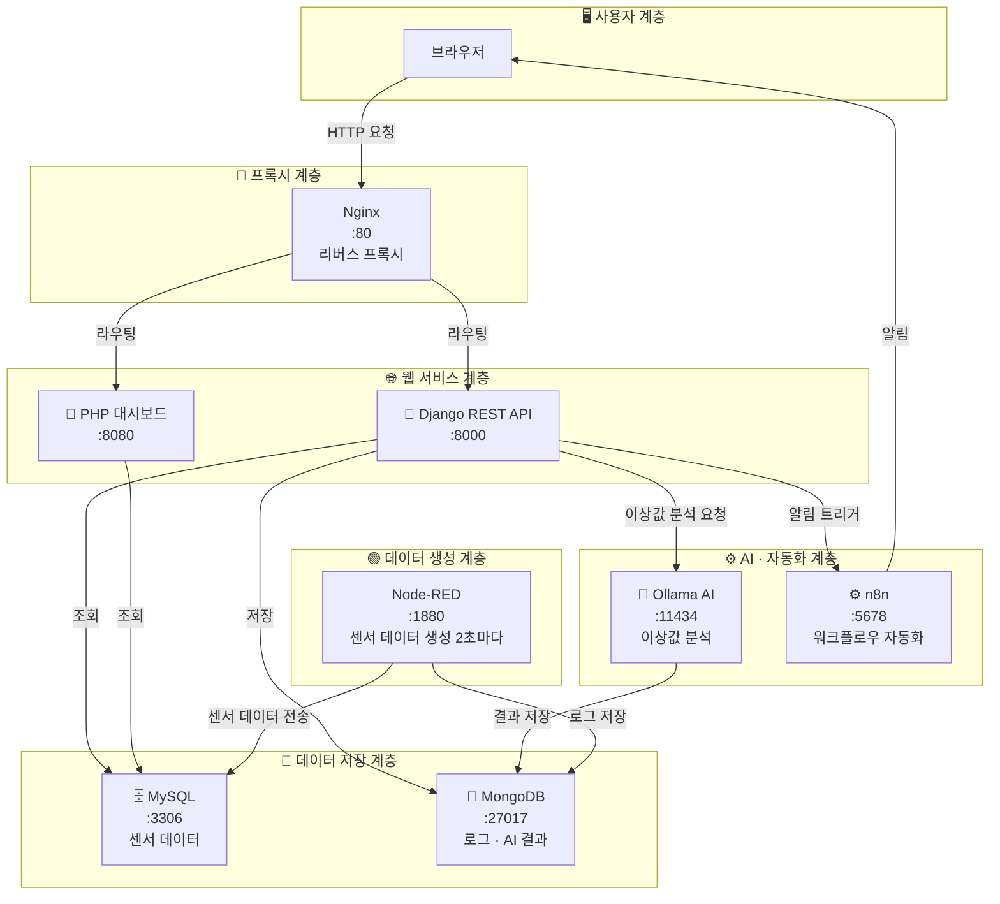

# 🌱 스마트팜 제어 시스템 (Smart Farm Control System)

Docker 기반의 스마트팜 센서 데이터 수집 · 분석 · 모니터링 통합 시스템

---

## 📌 프로젝트 개요

Node-RED로 생성된 가상 센서 데이터를 수집하고, Django REST API와 AI(Ollama)를 통해 이상값을 분석하며, 실시간으로 모니터링할 수 있는 스마트팜 통합 플랫폼입니다.

---

## 🔄 시스템 아키텍처



---

## 📋 계층별 역할 요약

| 계층 | 서비스 | 역할 |
|------|--------|------|
| **사용자** | 브라우저 | 대시보드 및 API 모니터링 |
| **프록시** | Nginx | 외부 요청을 내부 서비스로 라우팅 |
| **웹 서비스** | Django, PHP | REST API 제공, 웹 대시보드 |
| **AI / 자동화** | Ollama, n8n | 이상값 분석, 자동 알림 워크플로우 |
| **데이터 저장** | MySQL, MongoDB | 센서 데이터, 로그 및 AI 결과 저장 |
| **데이터 생성** | Node-RED | 2초마다 가상 센서 데이터 생성·전송 |

---

## 🛠 기술 스택

| 서비스 | 역할 | 포트 |
|--------|------|------|
| **Docker** | 전체 서비스 컨테이너 관리 | - |
| **Node-RED** | 센서 데이터 생성 및 전송 | 1880 |
| **Django** | REST API 서버 (데이터 조회·통계) | 8000 |
| **MySQL** | 센서 데이터 저장 | 3306 |
| **MongoDB** | 로그 및 AI 분석 결과 저장 | 27017 |
| **n8n** | 워크플로우 자동화 (이상값 알림) | 5678 |
| **Ollama** | AI 이상값 감지 및 분석 | 11434 |
| **Nginx** | 리버스 프록시 | 80 |
| **PHP** | 웹 대시보드 | 8080 |

---

## 📡 API 엔드포인트

| 엔드포인트 | 설명 |
|-----------|------|
| `GET /api/data/recent/` | 최근 센서 데이터 50건 조회 |
| `GET /api/stats/summary/` | 전체 통계 요약 (평균·최대·최소·알림 수) |
| `GET /api/stats/hourly/` | 시간대별 통계 |
| `GET /api/mongo/logs/` | MongoDB 로그 조회 |
| `GET /api/ai/save/` | AI 분석 결과 저장 |

### 통계 요약 응답 예시

```json
{
  "total_records": 1668,
  "avg_temp": 28.05,
  "max_temp": 47.6,
  "min_temp": 24.5,
  "avg_humid": 49.48,
  "avg_soil": 44.14,
  "avg_co2": 813.86,
  "alert_count": 3
}
```

### 센서 데이터 응답 예시

```json
[
  {
    "id": 3008,
    "temperature": 27.2,
    "humidity": 50.1,
    "soil_moisture": 50.2,
    "light_intensity": 57822.0,
    "co2_level": 801.0,
    "created_at": "2026-04-24 06:59:38"
  }
]
```

---

## 🚀 실행 방법

### 사전 요구사항

- Docker
- Docker Compose

### 실행

```bash
# 프로젝트 폴더로 이동
cd ~/Desktop/midtest

# 전체 서비스 실행
docker compose up -d

# 실행 상태 확인
docker ps
```

### 서비스 접속

| 서비스 | 주소 |
|--------|------|
| Node-RED | http://localhost:1880 |
| Django API | http://localhost:8000/api/stats/summary/ |
| n8n | http://localhost:5678 |
| PHP 대시보드 | http://localhost:8080 |

### 종료

```bash
docker compose down
```

---

## 📁 프로젝트 구조

```
midtest/
├── django/            # Django REST API 서버
├── mongodb/           # MongoDB 설정
├── mysql/             # MySQL 초기화 스크립트
├── nginx/             # Nginx 설정
├── nodered/           # Node-RED 플로우
├── php/               # PHP 웹 대시보드
├── docker-compose.yml # 전체 서비스 정의
├── start.sh           # 시작 스크립트
└── stop.sh            # 종료 스크립트
```

---

## 📊 수집 센서 데이터 항목

| 항목 | 단위 | 설명 |
|------|------|------|
| `temperature` | °C | 온도 |
| `humidity` | % | 습도 |
| `soil_moisture` | % | 토양 수분 |
| `light_intensity` | lux | 조도 |
| `co2_level` | ppm | CO2 농도 |

---

## ⚠️ 이상값 감지

Ollama AI가 센서 데이터를 분석하여 정상 범위를 벗어난 값을 감지합니다.

예시: 온도 **45.8°C** 감지 → `alert_count` 증가 → n8n 자동 알림 발송
